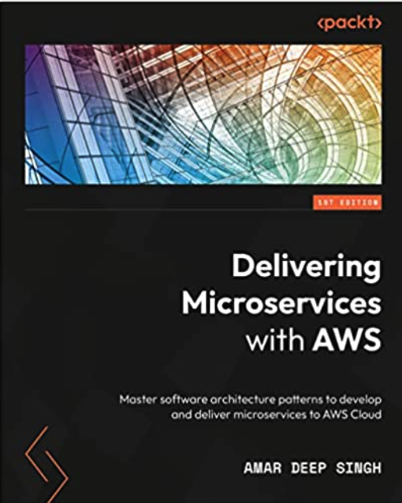

# Building and Delivering Microservices on AWS: Master software architecture patterns to develop and deliver microservices to AWS Cloud

This book provides a step-by-step guide to developing a Java Spring Boot microservice and guides you
through the process of automated deployment using AWS CodePipeline. It starts with an introduction to
software architecture and different architecture patterns, then dives into microservices architecture and
related patterns. This book will also help you to write the source code and commit it to CodeCommit
repositories, review the code using CodeGuru, build artifacts, provision infrastructure using Terraform
and CloudFormation, and deploy using AWS CodeDeploy to Elastic Compute Cloud (EC2) instances,
on-prem instances, ECS services, and Kubernetes clusters.
##  Who this book is for
This book is for software architects, DevOps engineers, site reliability engineers (SREs), and cloud
engineers who want to learn more about automating their release pipelines to modify features and release
updates. Some knowledge of AWS cloud, Java, Maven, and Git will come in handy to get the most out
of this book.
## What this book covers
Chapter 1, Software Architecture Patterns, teaches you about software architecture and about different
software architecture patterns.
Chapter 2, Microservices Fundamentals and Design Patterns, describes microservices and different
patterns related to microservices. In addition, this chapter explains different strategies and design
patterns to break a monolithic application into a microservice.
Chapter 3, CI/CD Principles and Microservice Development, covers different CI/CD principles and explains
how to create a sample Java Spring Boot application to be deployed as a microservice and expose a
REpresentational State Transfer (REST) endpoint to ensure that our users can access this endpoint.
Chapter 4, Infrastructure as Code, explains what Infrastructure as Code (IaC) means and what tools
and technologies you can use to provision different resources. We will guide you on how you can run
a CloudFormation template and how you can create infrastructure using Terraform.
Chapter 5, Creating Repositories with AWS CodeCommit, explains what a version control system
is and covers the basics of Git-based version control systems. This chapter explains the AWS
CodeCommit service and its benefits and then guides users on committing application source code
to the CodeCommit repository.
Chapter 6, Automating code reviews Using CodeGuru, walks through what the AWS CodeGuru
artificial intelligence (AI) service is and how it can be used to review code automatically and scan
for vulnerabilities.
Chapter 7, Managing Artifacts Using CodeArtifact, explains the AWS CodeArtifact service, its usage,
and its benefits. This chapter walks through the different generated artifacts and how they can be
securely stored with CodeArtifact.
Chapter 8, Building and Testing Using AWS CodeBuild, focuses on the AWS CodeBuild service and
explains how you can use this service to customize the build and code testing process.
Chapter 9, Deploying to an EC2 Instance Using CodeDeploy, explains the AWS CodeDeploy service and
how it can be used to deploy applications to EC2 instances and on-premises servers. This chapter takes
a deep dive into different deployment strategies and configurations available to deploy applications.
Chapter 10, Deploying to an ECS Cluster Using Code Deploy, focuses on explaining what a container
is and how you can deploy Docker containers to an AWS ECS service. In this chapter, we configure
CodeDeploy to automatically deploy sample applications to ECS containers.
Chapter 11, Setting Up CodePipeline, explains what CodePipeline is and how it can help us to orchestrate
other AWS services to set up continuous development and delivery of the software.
Chapter 12, Setting Up Automated Serverless Deployment, introduces you to serverless ecosystems and
how AWS provides scalable solutions through Lambda, and how you can set up automated serverless
Lambda deployment.
Chapter 13, Automated Deployment to an EKS Cluster, focuses on understanding Kubernetes and
learning about the Elastic Kubernetes Service (EKS) provided by AWS and automated application
deployment to an EKS cluster using CodePipeline.
### Chapter 14, Extending CodePipeline Beyond AWS
####### Focuses on extending AWS CodePipeline beyond AWS-related infrastructure and services. In this chapter, you will learn to integrate CodePipeline with Bitbucket and Jenkins and deploy to instances hosted outside AWS.
### Chapter 15, Appendix,
####### Focuses on creating Identity and Access Management (IAM) users and tools needed for the application development such as Docker Desktop, Git, and Maven, which are important but not part of the core chapters.

## Download the example code files
You can download the example code files for this book from GitHub at https://github.com/PacktPublishing/Delivering-Microservices-with-AWS. If there’s an update to the code, it will be updated in the GitHub repository.